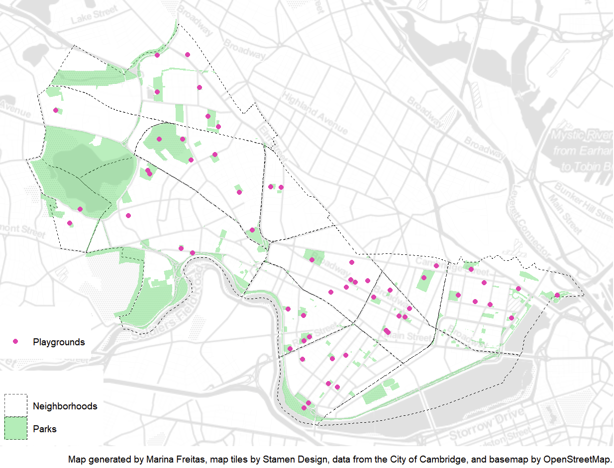

```{r setup, include=FALSE}
knitr::opts_chunk$set(echo = TRUE)
```

This is an example of a portfolio that someone might assemble to demonstrate the skills they have developed in VIS 2128. I have created this page using RMarkdown. There are fancier tools out there for creating and hosting webpages, and you are welcome to use any of those if you like. The advantage of this approach is that you can create your webpage directly from RStudio.

This example uses the default theme, since I haven't specified a theme in the YAML header, but I have set up a floating table of contents.

Your portfolio should demonstrate each of the following skills (not all of which are demonstrated in this example):

* Displaying multiple vector layers on the same map
* Calculating and displaying relationships among point and polygon layers based on distance
* Aggregating point data to a layer of polygons
* Calculating and displaying accessibility, based on travel time
* Converting between raster layers and vector layers
* Displaying raster data on a map
* Georeferencing a raster image
* Displaying data on an interactive map

# Map 01
This map demonstrates the following skills: 

* Displaying multiple vector layers on the same map

[](https://github.com/freitasmarina/spatialanalysis_portfolio/fullsize/map1.pdf){target="_blank"}


